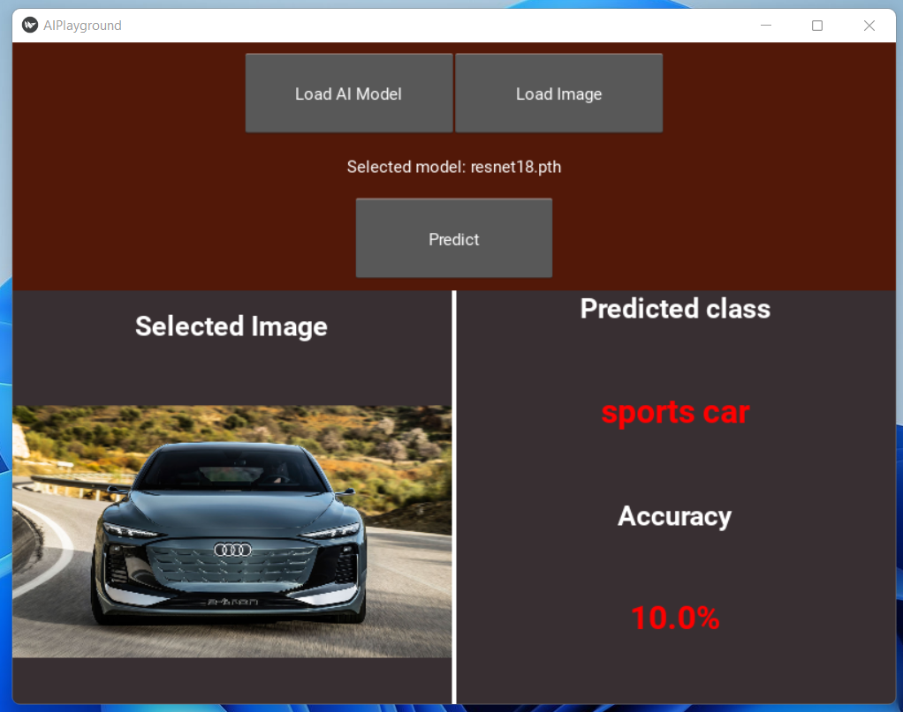

# AI Playgroung GUI
A user-friendly GUI to easy test any pytorch multi-class model with a sample image.

# Installation

- Clone the git project with 
  ```bash 
   git clone https://github.com/pericles01/AI_Playgroung.git
   cd AI_Playgroung
  ```
- Run the shell code below to install the project dependencies
  ```bash
   conda env create -f ./environment.yml
  ```
- Activate the virtual environment
    ```bash
    conda activate Vapp
    ```
    Can be deactivted after the use with ``conda deactivate``
# Run
- for windows
    ```bash
    python main.py
    ```
- for Linux
    ```bash
    python3 main.py
    ```
# Test
A test with a simple resnet18 torch model on a vehicle image (in ressource forlder).


